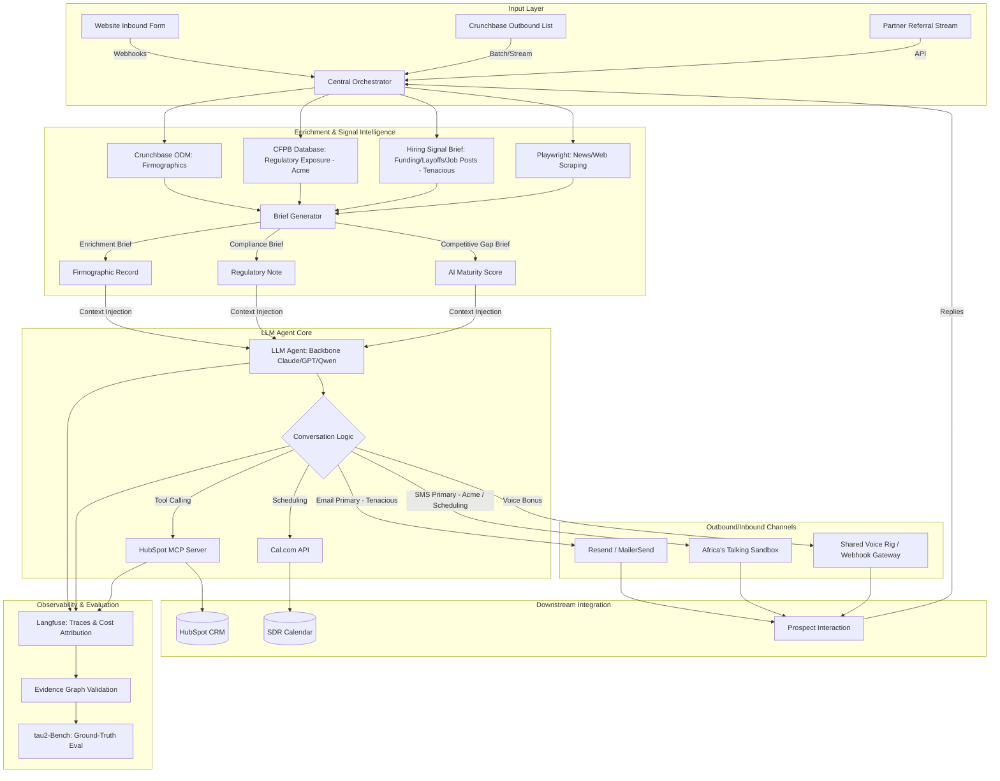
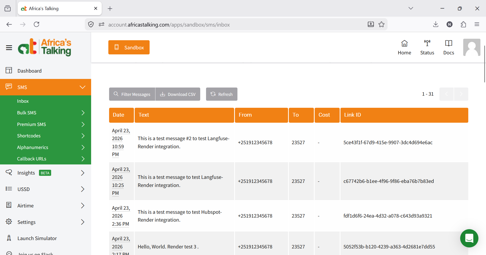
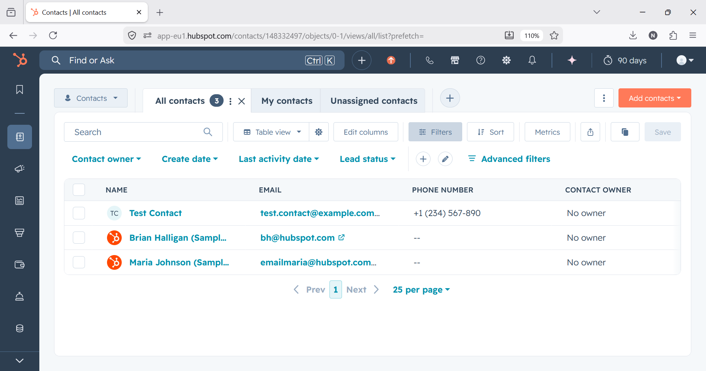
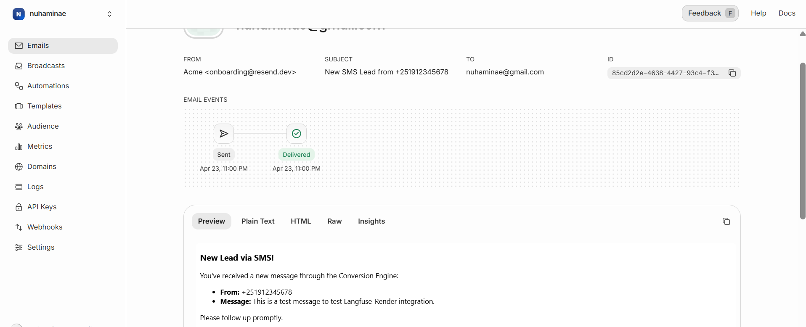

# The-Conversion-Engine

[](https://github.com/nuhaminae/The-Conversion-Engine/actions/workflows/ci.yml)


---

## Project Overview

The **Conversion Engine** is a multi-layered automation system designed to handle the full lifecycle of B2B lead development from initial discovery and deep research-driven enrichment to multi-channel outreach and final meeting booking.

---

### The conversion engine architectural design

Below is the detailed system architecture in Mermaid format, reflecting the core components described across the sources:



---

### Core Architectural Components

- **Enrichment Pipeline:** This layer is critical for moving beyond generic outreach. For Acme ComplianceOS, it identifies **regulatory exposure** via the CFPB database. For Tenacious, it generates a **hiring signal brief** and **competitor gap brief**, scoring prospects on **AI maturity** (0–3 scale) to tailor the pitch.
- **LLM Agent Core:** The "brain" of the system uses a development-tier LLM (like Qwen or DeepSeek) for iteration and an evaluation-tier (Claude or GPT-5) for high-stakes interactions. It operates through **dual-control coordination**, waiting for user input or taking tool actions as required.
- **Channel Priority:** The architecture adapts to the target segment. In the compliance version, **SMS** is the primary driver for "speed-to-lead". In the Tenacious version, **Email** is primary for professional outreach to executives, while SMS is reserved for warm-lead scheduling.
- **HubSpot MCP Integration:** The system uses a **Model Context Protocol (MCP)** server to allow the agent to read and write directly to HubSpot, ensuring all interactions, transcripts, and firmographic data are structured as a record of truth.
- **Observability & Validation:** **Langfuse** captures every trace, tool call, and token cost. This data feeds into an **Evidence-Graph**, which maps every claim (e.g., "cost per qualified lead") back to a specific trace file for auditability.

---

- [The-Conversion-Engine](#the-conversion-engine)
  - [Project Overview](#project-overview)
    - [The conversion engine architectural design](#the-conversion-engine-architectural-design)
    - [Core Architectural Components](#core-architectural-components)
  - [Project Structure (Snippet)](#project-structure-snippet)
  - [Installation](#installation)
    - [Prerequisites](#prerequisites)
    - [Setup](#setup)
    - [Deploying to Render](#deploying-to-render)
    - [Setting up Webhooks](#setting-up-webhooks)
  - [Usage](#usage)
  - [Setup proofs](#setup-proofs)
  - [Project Status](#project-status)

---

## Project Structure (Snippet)

```bash
The-Conversion-Engine/ 
├── .env                      # Stores all API keys and secrets 
├── .gitignore
│
├── conversion_engine_backend/ 
│   ├── __init__.py                       
│   └── main.py               # FastAPI application for handling webhooks (email, SMS) 
│
├── enrichment/               # Signal enrichment pipeline scripts
│   ├── __init__.py
│   ├── crunchbase.py         # Fetches data from the Crunchbase ODM sample
│   ├── jobs.py               # Scrapes job posts via Playwright
│   ├── layoffs.py            # Parses layoff data from layoffs.fyi
│   └── core.py               # Orchestrates the enrichment and generates briefs
│
├── llm/                # Logic for Large Language Model interactions
│   ├── __init__.py
│   ├── prompts.py      # Prompt templates based on the style_guide.md
│   └── core.py         # Core logic for generating email/SMS content
│
└── services/           # Logic for interacting with external services
│   ├── __init__.py
│   ├── hubspot_service.py # Handles creating and updating HubSpot contacts
│   ├── cal_service.py    # Handles booking meetings with Cal.com
│   └── email_service.py  # Logic for sending emails via Resend
│
├── data/                   # Directory for local data sources
│   ├── crunchbase_odm.csv  # The downloaded Crunchbase dataset
│   └── layoffs.csv         # The downloaded layoffs.fyi dataset
│
├── eval/                   # Evaluation harness, logs, and reports
│   ├── tau2-bench/         # The cloned tau2-bench repository (not pushed)
│   ├── harness.py          # Your wrapper script for running benchmarks
│   ├── score_log.json      # Benchmark results 
│   ├── trace_log.jsonl     # Raw simulation traces (you already have a sample)
│   └── baseline.md         # Your analysis of the baseline run
│
├── infra/                  # Infrastructure configuration
│   ├── docker-compose.yml  # For running Cal.com locally
│   ├── smoke_test.sh       # The Day 0 readiness script
│   └── cal_fixtures/       # Mock calendar data for testing
│
├── probes/                 # Files for Act III (Adversarial Probing)
│   ├── probe_library.md
│   └── failure_taxonomy.md
│
├── reports/                # Final deliverables for submission
│   ├── memo.pdf            # The final 2-page decision memo for Tenacious
│   └── evidence_graph.json # Machine-readable mapping of claims to traces
│
└──  README.md             # Project overview, architecture diagram, and setup instructions
```

---

## Installation

### Prerequisites

- Python 3.12  
- Git  
- Docker (for local Cal.com testing)  
- Render account (free tier is sufficient)
- Hubspot account
  
---

### Setup

```bash
git clone https://github.com/nuhaminae/The-Conversion-Engine.git
cd The-Conversion-Engine
uv sync   # recommended dependency management
```

---

### Deploying to Render

1. **Create a Render account**  
   Sign up at [render.com](https://render.com) (no credit card required).

2. **Provision a Web Service**  
   - Click **New → Web Service**.  
   - Connect your GitHub repo (`The-Conversion-Engine`).  
   - Select branch `main`.  
   - Environment: Python 3.12.  

    ```bash
    #Build command: 
    poetry install

    #Start command:  
    poetry run uvicorn conversion_engine_backend.main:app --host 0.0.0.0 --port $PORT
    ```

3. **Verify Deployment**  
   After build completes, Render will give you a public URL like:  

   ```bash
   https://the-conversion-engine.onrender.com
   ```  

   Visit it in your browser. You should see:  

   ```json
   {"status":"ok","message":"FastAPI is running on Render"}
   ```

---

### Setting up Webhooks

Use the Render public URL. For example:

- **Africa’s Talking Sandbox → SMS Callback URL**  
- **Resend / MailerSend → Reply Webhook URL**
- **HubSpot MCP → Conversation Events Webhook URL**  
- **Cal.com → Booking Events Webhook URL**
  
``` bash
https://the-conversion-engine.onrender.com/webhook
```

---

## Usage

1. Send message to short number created in Africa's Talking. Make sure webhook is set in `Callback URLs`. It is sucessful when you get an email in your inbox set in the env.

2. To create contact in hubspot, run:

``` bash
https://the-conversion-engine.onrender.com/create-test-contact
```

If sucessful you will see, example:

```json
{
  "status": "success",
  "contact_id": "763259095241"
}
```

3. Clone and setup `Cal.com`

---

## Setup proofs







---

## Project Status

The project is underway, check the [commit history](https://github.com/nuhaminae/The-Conversion-Engine/) for updates.

- **webhook.log**  
  Contains at least two entries: one SMS webhook trace and one HubSpot contact creation trace. These demonstrate end‑to‑end observability through Langfuse.

- **score_log.json**  
  References the program‑provided baseline run using `openrouter/qwen/qwen3-next-80b-a3b-thinking`. No reproduction required; one trial is sufficient.

- **baseline.md**  
  Summarises the baseline (provided), current stack setup (Render, Africa’s Talking, HubSpot, Langfuse), and confidence in traces. Cal.com setup is in progress.

- [x] Render backend deployed and reachable at public URL.  
- [x] Africa’s Talking sandbox provisioned, SMS webhook tested.  
- [x] HubSpot Developer Sandbox provisioned, test contact created.  
- [x] Langfuse cloud project created, test trace visible.  
- [x] Cal.com cloning in progress (Docker Compose setup).  
- [x] OpenRouter API key configured, ready for enrichment/qualification logic.  

Budget usage: all free tiers so far; $10 allocation remains intact.
